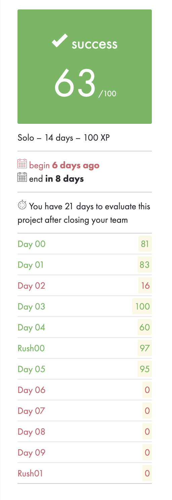

# Php_piscine - basics of web developement 📧
This project is a quick introdution to backend technologies, sql requests and html/css/js from the very beginning. 📖

Php piscine consits of 10 daily projects and two team projects (called rush0x), allowing you to create some real-life code like a fully fuctional e-commerce website.

### Subjects:
* [Day00 of php piscine](https://github.com/psprawka/Php_piscine/day00/d00.en.pdf) 
* [Day01 of php piscine](https://github.com/psprawka/Php_piscine/day01/d01.en.pdf)
* [Day02 of php piscine](https://github.com/psprawka/Php_piscine/day02/d02.en.pdf)
* [Day03 of php piscine](https://github.com/psprawka/Php_piscine/day03/d03.en.pdf)
* [Day04 of php piscine](https://github.com/psprawka/Php_piscine/day04/d04.en.pdf)
* [Day05 of php piscine](https://github.com/psprawka/Php_piscine/day05/d05.en.pdf)
* [Day06 of php piscine](https://github.com/psprawka/Php_piscine/day06/d06.en.pdf)
* [Day07 of php piscine](https://github.com/psprawka/Php_piscine/day07/d07.en.pdf)
* [Day08 of php piscine](https://github.com/psprawka/Php_piscine/day08/d08.en.pdf)
* [Day09 of php piscine](https://github.com/psprawka/Php_piscine/day09/d09.en.pdf)
* [Rush00 - php piscine](https://github.com/psprawka/Php_piscine/rush00/rush00.en.pdf)

### How to run the exercises?
Some of the exercises that contain .php extention can be run directly from a shell, but some of them may require a local server like Mamp or so.

### My grades for php_piscine
I did not submit all the days since I didn't have time to finish all of them due to multiple ongoing projects.

  

### Have fun and use the code wisely! 🚔
